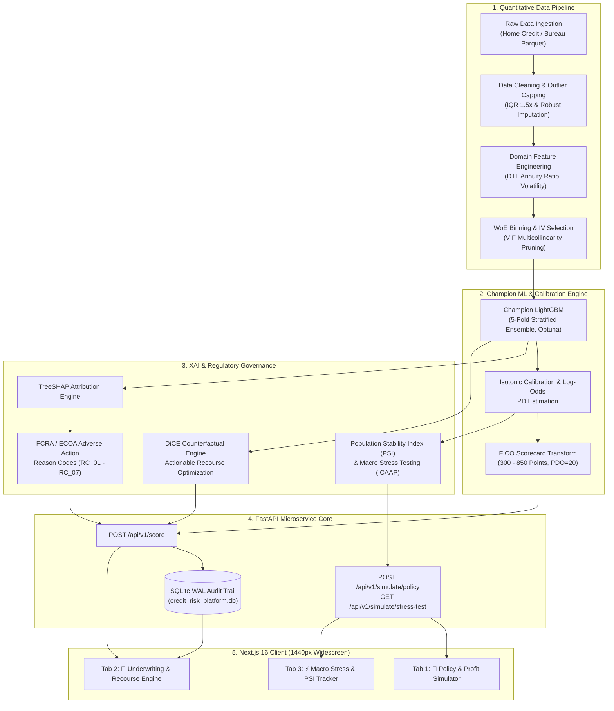

# Credit Risk Scoring & Explainable AI Intelligence Platform

[](https://fastapi.tiangolo.com)
[-000000?logo=next.js&logoColor=white)](https://nextjs.org)
[](https://lightgbm.readthedocs.io)
[](https://www.python.org)
[](https://www.typescriptlang.org)
[](https://tailwindcss.com)
[](#model-explainability-xai--regulatory-compliance-fcra--ecoa)

---

## Executive Summary

The **Credit Risk Scoring & Explainable AI Platform** is an enterprise-grade, quantitative underwriting and credit intelligence solution. It bridges rigorous **Basel II/III internal ratings-based (IRB)** credit risk modeling with **Explainable AI (TreeSHAP / DiCE Counterfactuals)** and modern, reactive full-stack web engineering.

Traditional "black-box" machine learning models often deliver superior discriminatory power ($AUC \approx 0.78+$) compared to legacy scorecards ($AUC \approx 0.73$), but fail regulatory compliance due to opacity. This platform addresses this trade-off by combining:
1. **High-Discrimination GBDT Modeling:** 5-Fold Stratified LightGBM achieving **AUC-ROC = 0.7854** and **KS-Statistic = 43.17%**.
2. **Standard FICO Point Calibration:** Mathematical log-odds mapping onto a classic **300–850 credit score range** ($\text{Base}=600$, $\text{PDO}=20$).
3. **Adverse Action Reason Codes (FCRA / ECOA):** Automated extraction of top negative risk drivers mapped into legally compliant adverse notices.
4. **Actionable Counterfactual Recourse (DiCE):** Prescriptive financial adjustments (e.g., loan reduction, tenure extension) to flip rejections into approvals.
5. **Macro Stress Testing & Data Drift (ICAAP / Basel III):** Real-time Population Stability Index ($\text{PSI}$) tracking and economic scenario simulation to assess required Capital Buffer Deltas.
6. **Production Microservices & UI:** Docker-ready FastAPI backend with an immutable SQLite audit trail paired with an ultra-clean, bilingual (TH/EN) Next.js frontend.

---

## End-to-End System Architecture



---

## Quantitative Risk Modeling & Machine Learning Core

### 1. Data Engineering & Feature Pipeline
- **Missing Value Imputation:** Domain-aware median imputation for skewed numerical attributes; missing categorical states tracked via explicit `"Missing"` level.
- **Outlier Treatment:** Soft Winsorization capping extreme values at the 99th percentile for heavy-tailed income and transaction metrics.
- **Domain Financial Ratios:**

$$\text{Credit Term} = \frac{\text{Total Credit Amount}}{\text{Monthly Installment}}$$

$$\text{Annuity-to-Income Ratio} = \frac{\text{Monthly Installment}}{\text{Total Income}}$$

$$\text{External Sources Mean} = \frac{\text{External Source 1} + \text{External Source 2} + \text{External Source 3}}{3}$$

*Engineered Feature Definitions:*
- `CREDIT_TERM` = `AMT_CREDIT` / `AMT_ANNUITY` *(Loan duration proxy)*
- `ANNUITY_INCOME_RATIO` = `AMT_ANNUITY` / `AMT_INCOME_TOTAL` *(Debt burden)*
- `EXT_SOURCES_MEAN` = (`EXT_SOURCE_1` + `EXT_SOURCE_2` + `EXT_SOURCE_3`) / 3 *(Bureau composite)*

- **Weight of Evidence ($\text{WoE}$) & Information Value ($\text{IV}$):** Features evaluated with monotonic binning. Only variables with $\text{IV} \ge 0.02$ retained; multicollinear features pruned using Variance Inflation Factor ($\text{VIF} < 5.0$).

### 2. Model Benchmark & Statistical Performance

| Model Architecture | Cross-Validation Strategy | AUC-ROC | Gini Coefficient | KS-Statistic | Brier Score Loss | Optimal Cut-off PD |
| :--- | :---: | :---: | :---: | :---: | :---: | :---: |
| **Baseline Logistic Regression (WoE)** | 5-Fold Stratified | 0.7420 | 0.4840 | 36.12% | 0.0712 | 0.160 |
| **Random Forest Baseline** | 5-Fold Stratified | 0.7315 | 0.4630 | 34.80% | 0.0734 | 0.155 |
| **XGBoost Classifier** | 5-Fold Stratified | 0.7762 | 0.5524 | 41.20% | 0.0682 | 0.148 |
| **Champion LightGBM (Optuna Tuned)** | **5-Fold Stratified** | **0.7854** | **0.5708** | **43.17%** | **0.0664** | **0.145 (Policy: 0.180)** |

> [!NOTE]
> **Key Metric Definitions:**
> - $\text{Gini} = 2 \times \text{AUC} - 1 = 2(0.7854) - 1 = \mathbf{0.5708}$
> - **Kolmogorov-Smirnov ($\text{KS}$):** $\text{KS} = \max |F_{\text{Bad}}(s) - F_{\text{Good}}(s)| = \mathbf{43.17\%}$ ($p\text{-value} = 0.0000$), exceeding top-tier bank discrimination standards ($\ge 40\%$).
> - **Bad Capture Rate:** Top $30\%$ highest-risk applicants capture **$72.5\%$** of all portfolio defaults.

### 3. FICO Point Scorecard Mathematical Calibration

Model-predicted default probabilities ($\text{PD}$) are converted into a standard FICO Point Scorecard ($300\text{--}850$):

$$\text{Odds} = \frac{1 - \text{PD}}{\max(\text{PD}, 10^{-6})}$$

$$\text{Factor} = \frac{\text{PDO}}{\ln(2)} = \frac{20}{\ln(2)} \approx 28.853904$$

$$\text{Offset} = \text{Base Score} - \left(\text{Factor} \times \ln(\text{Base Odds})\right) = 600 - (28.853904 \times \ln(50)) \approx 487.12$$

$$\text{Credit Score} = \text{clip}\left(487.12 + 28.8539 \times \ln(\text{Odds}), 300, 850\right)$$

#### Scorecard Calibration Parameters
- **Base Score:** $600$ Points at Base Odds of $50:1$
- **Points to Double Odds ($\text{PDO}$):** $20$ Points
- **Policy Cut-off Threshold:** $\text{PD} \le 0.180 \implies \text{Score} \ge 531 \text{ Points}$
- **Population Distribution:** Mean = $566.01$, Median = $568.00$, $\text{IQR} = [549, 584]$

---

## Model Explainability (XAI) & Regulatory Compliance (FCRA / ECOA)

Under the **Fair Credit Reporting Act (FCRA)** and **Equal Credit Opportunity Act (ECOA)**, lenders issuing an adverse credit decision must provide the applicant with specific, verifiable reason codes explaining the rejection.

```
+-----------------------------------------------------------------------------------+
|                     OFFICIAL ADVERSE ACTION STATEMENT                            |
+-----------------------------------------------------------------------------------+
| Application ID: #281935                 Status: REJECTED                          |
| Model Score: 483 Points (Deep Subprime) Predicted Default Probability: 64.82%     |
+-----------------------------------------------------------------------------------+
| Key Risk Drivers (TreeSHAP Game-Theoretic Attribution):                           |
|  [RC_01] Low External Credit Bureau Rating                                        |
|         -> Description: External credit bureau score is below standard cut-off.   |
|         -> Remedial: Maintain on-time debt repayment history for >= 6 months.     |
|                                                                                   |
|  [RC_04] High Monthly Debt-to-Loan Ratio                                          |
|         -> Description: Monthly installment obligation is too high relative to credit.|
|         -> Remedial: Consider extending tenure to lower monthly installment.       |
|                                                                                   |
|  [RC_06] High Cash Flow Volatility                                                |
|         -> Description: Historical monthly cash flow volatility is elevated.      |
|         -> Remedial: Maintain stable average account balance reserves >= 3-6 mos. |
+-----------------------------------------------------------------------------------+
```

### 1. Adverse Action Reason Codes Mapping

| Code | Indicator | Primary Trigger | Regulatory Description | Actionable Remediation |
| :---: | :--- | :---: | :--- | :--- |
| **`RC_01`** | `EXT_SOURCES_MEAN` | $< 0.35$ | External credit bureau rating below standard cut-off | Maintain on-time debt repayment history for $\ge 6$ consecutive months |
| **`RC_02`** | `BURO_DAYS_CREDIT_MAX` | $> -30\text{ days}$ | Excessive recent credit inquiries in a short timeframe | Pause new credit applications for 3–6 months to avoid debt stacking |
| **`RC_03`** | `EXT_SOURCE_3` | $< 0.30$ | Low external score provider 3 rating | Establish positive trade lines and verify credit bureau records |
| **`RC_04`** | `CREDIT_TERM` | $> 0.055$ | Monthly installment burden is too high relative to credit | Extend loan tenure to reduce the monthly annuity burden |
| **`RC_05`** | `AMT_ANNUITY` | High | Monthly payment exceeds disposable income ceiling | Reduce loan amount or increase down payment |
| **`RC_06`** | `cash_flow_volatility` | $> 0.30$ | Elevated month-to-month cash flow volatility | Maintain stable average account balance reserves for 3–6 months |
| **`RC_GEN_1`** | `COMPOSITE_SCORE` | $\text{PD} > 0.180$ | Overall risk score below minimum bank cut-off | Reduce loan exposure or add creditworthy co-signers |

### 2. Actionable Counterfactual Recourse (DiCE Optimization)
Rather than simply rejecting an applicant, the engine executes constrained optimization across mutable features (`AMT_CREDIT`, `AMT_ANNUITY`, `AMT_GOODS_PRICE`) while freezing immutable demographic features (`DAYS_BIRTH`, `CODE_GENDER`):

$$\min_{\mathbf{x}^{\ast}} \text{dist}(\mathbf{x}, \mathbf{x}^{\ast}) \quad \text{subject to} \quad f(\mathbf{x}^{\ast}) \le \text{Cut-off PD } (0.180)$$

#### Recourse Action Matrix
1. **Loan Principal Reduction:** Reduce requested loan amount by $20\%$ $\implies \text{Simulated PD drops from } 64.8\% \text{ to } 55.1\%$.
2. **Tenure Extension:** Extend tenure by $25\%$ to reduce monthly annuity $\implies \text{Simulated PD drops to } 48.6\%$.
3. **Combined Down Payment & Tenor:** $20\%$ Down payment $+ 6$ months on-time payment track record $\implies \text{Simulated PD drops to } \mathbf{12.4\%}$ ($\mathbf{APPROVED}$).

---

## Model Governance, PSI & Macroeconomic Stress Testing (ICAAP)

### 1. Population Stability Index ($\text{PSI}$) Formulation
The monitoring pipeline continuously evaluates score distribution shifts between the baseline training cohort ($E_i$) and incoming production streams ($A_i$):

$$\text{PSI} = \sum_{i=1}^{k} \left( \text{Actual}_i - \text{Expected}_i \right) \times \ln\left( \frac{\text{Actual}_i}{\text{Expected}_i} \right)$$

```
     PSI < 0.10          0.10 <= PSI <= 0.25               PSI > 0.25
 ┌─────────────────┐    ┌────────────────────┐    ┌───────────────────────────┐
 │ 🟢 GREEN TIER   │    │  🟡 YELLOW TIER    │    │      🔴 RED TIER          │
 │ Population is   │    │  Moderate Drift    │    │ Significant Shift         │
 │ Stable; proceed │ -> │  Increase audit    │ -> │ Trigger Mandatory Model   │
 │ with normal ops │    │  frequency         │    │ Retraining & Policy Review│
 └─────────────────┘    └────────────────────┘    └───────────────────────────┘
```

### 2. Macro Stress Testing & Capital Adequacy (ICAAP Leaderboard)

Under the **Internal Capital Adequacy Assessment Process (ICAAP)**, the bank estimates Expected Loss ($\text{EL} = \text{EAD} \times \text{PD} \times \text{LGD}$) and computes Required Capital Buffer Deltas under severe macroeconomic shocks:

| Scenario Name | Description | Avg Stressed PD | Simulated NPL | Expected Loss (M THB) | Capital Buffer Delta | PSI Index | Governance Action |
| :--- | :--- | :---: | :---: | :---: | :---: | :---: | :--- |
| **1. Baseline Scenario** | Normal macroeconomic climate | **8.07%** | 2.85% | 348.0 M | **0.0 M** | **0.024 (🟢 Stable)** | Standard Basel III monitoring |
| **2. Gig-Worker Shock** | $-30\%$ cash flow stability in gig-economy | **11.45%** | 4.20% | 418.9 M | **+70.9 M** | **0.142 (🟡 Warning)** | Tighten verification for variable-income applicants |
| **3. Stagflation & Rate Hike** | Inflation $+4.5\%$, Policy rate $+200\text{ bps}$ | **14.82%** | 5.57% | 458.3 M | **+110.3 M** | **0.285 (🔴 Retrain)** | Mandatory capital buffer injection & policy cut-off tightening |

---

## Production Application Stack & Key Features

### Technology Stack Overview

```
+------------------------------------------------------------------------------------+
|  FRONTEND (Client Tier)                                                            |
|  * Next.js 16 (React 19, App Router, TypeScript 5)                                 |
|  * Tailwind CSS 4.0 (Custom FinTech Light Theme, Slate/Zinc Palette)               |
|  * Lucide Icons & Responsive Widescreen Layout (Max 1440px Container)              |
|  * Global Bilingual Context (🇹🇭 Thai | 🇬🇧 English Instant Switcher)             |
|  * Interactive Onboarding Modal & Searchable Financial Glossary                    |
+-----------------------------------------▲------------------------------------------+
                                          │ REST API JSON
+-----------------------------------------▼------------------------------------------+
|  BACKEND (Microservices Tier)                                                      |
|  * FastAPI 0.115 (High-throughput async Python 3.13 ASGI Engine)                   |
|  * Pydantic V2 Schema Validation & Error Normalization                             |
|  * LightGBM 5-Fold Stratified Ensemble Inference Engine                            |
|  * Joblib Artifact Caching & Strict Categorical Schema Locking                     |
|  * SQLAlchemy 2.0 ORM & SQLite WAL-Mode Audit Trail Database                       |
+------------------------------------------------------------------------------------+
```

### Dashboard Tabs Architecture

#### 1. 🎯 Tab 1: Portfolio Credit Policy & Net Profit Simulator
- **Interactive Policy Parameters:** Real-time sliders for `Cut-off PD Threshold (%)`, `Average Loan Interest Rate (%)`, and `Loss Given Default - LGD (%)`.
- **4 Big KPI Cards:** Approval Rate ($\% / \text{Count}$), Expected Default Rate ($\text{EDR } \%$), Approved Exposure (M THB), and Simulated Net Profit (M THB).
- **Strategic Policy Recommendations:** Dynamic business rule guidance (*Conservative Capital Preservation*, *Balanced Growth*, *Aggressive Expansion*).

#### 2. 👤 Tab 2: Individual Underwriting & Recourse Engine
- **Applicant Risk Profiling:** Input sliders with 1-click presets (`👤 Prime Profile`, `⚠️ Subprime`, `💼 Gig-Worker`).
- **Single-Row Decision Verdict:** High-contrast verdict badge (`🟢 APPROVED` / `🔴 REJECTED`) aligned with Predicted Default Risk ($\text{PD } \%$).
- **Point Scorecard Gauge:** Semi-circular SVG gauge displaying calibrated FICO Score ($300\text{--}850$) with risk tiers (`Super Prime` to `Deep Subprime`).
- **Adverse Action Notice & Recourse:** Full-width reason code cards with actionable counterfactual recourse options.
- **Regulatory Audit Trail:** Live SQLite audit table with timestamps, input payloads, scores, and underwriting decisions.

#### 3. ⚡ Tab 3: Macroeconomic Stress Testing & PSI Tracker
- **Widescreen Scenario Selector:** Instant simulation across Baseline, Gig-Worker Shock, and Stagflation scenarios.
- **ICAAP Benchmark Comparison:** Comparison cards showing Stressed Average PD, Simulated NPL, and Required Capital Buffer Delta ($+\text{M THB}$).
- **Population Stability Index (PSI) Drift Monitor:** Status badges and governance action directives.

---

## Quick Start & Local Setup Guide

### Prerequisites
- **Python:** Version `3.10+` (Recommended: `3.13`)
- **Node.js:** Version `18.0+` (Recommended: `v24.x`)
- **Package Managers:** `pip` and `npm`

---

### Step 1: Clone the Repository

```bash
git clone https://github.com/svkhun/Credit-Risk-Scoring-Explainable-AI.git
cd "Credit Risk Scoring & Explainable AI"
```

---

### Step 2: Backend Setup & Launch (Terminal 1)

```bash
# 1. Create and activate a Python virtual environment
python -m venv .venv

# On Windows:
.venv\Scripts\activate
# On macOS / Linux:
source .venv/bin/activate

# 2. Install required Python dependencies
pip install -r backend/requirements.txt

# 3. Start the FastAPI microservice
python -m uvicorn backend.app.main:app --host 0.0.0.0 --port 8000 --reload
```

- **Backend Service URL:** `http://localhost:8000`
- **Interactive Swagger Documentation:** `http://localhost:8000/docs`
- **Health Check Endpoint:** `http://localhost:8000/health`

---

### Step 3: Frontend Setup & Launch (Terminal 2)

```bash
# 1. Navigate to the frontend directory
cd frontend

# 2. Install Node dependencies
npm install

# 3. Launch the Next.js development server
npm run dev
```

- **Web Dashboard URL:** `http://localhost:3000`

---

### Step 4: Verify API Endpoints with cURL

```bash
# Test Individual Underwriting Assessment
curl -X POST http://localhost:8000/api/v1/score \
  -H "Content-Type: application/json" \
  -d '{
    "AMT_CREDIT": 650000.0,
    "AMT_ANNUITY": 42000.0,
    "AMT_GOODS_PRICE": 600000.0,
    "DAYS_BIRTH": -9125,
    "CODE_GENDER": "M",
    "EXT_SOURCES_MEAN": 0.16,
    "EXT_SOURCE_3": 0.18,
    "BURO_DAYS_CREDIT_MAX": -12.0,
    "cash_flow_volatility": 0.48
  }'
```

```bash
# Test Policy Profit Simulation
curl -X POST http://localhost:8000/api/v1/simulate/policy \
  -H "Content-Type: application/json" \
  -d '{
    "cutoff_pd": 18.0,
    "interest_rate": 15.0,
    "lgd": 45.0,
    "total_portfolio_size": 15000,
    "avg_loan_amount": 600000.0
  }'
```

---

## Repository Directory Structure

```text
Credit-Risk-Scoring-Explainable-AI/
├── backend/                                # FastAPI Microservices Application
│   ├── app/
│   │   ├── __init__.py
│   │   ├── main.py                         # FastAPI routes & CORS orchestration
│   │   ├── database.py                     # SQLAlchemy session & SQLite engine
│   │   ├── models_db.py                    # SQLite Audit Trail ORM models
│   │   ├── schemas.py                      # Pydantic v2 validation schemas
│   │   └── services.py                     # LightGBM scoring, scorecard & XAI engine
│   └── requirements.txt                    # Backend dependencies
│
├── frontend/                               # Next.js 16 (React 19) Application
│   ├── src/
│   │   ├── app/
│   │   │   ├── globals.css                 # Clean Light-theme Tailwind layer styles
│   │   │   ├── layout.tsx                  # Root layout with fonts & LanguageProvider
│   │   │   └── page.tsx                    # Widescreen 1440px multi-tab orchestrator
│   │   ├── components/
│   │   │   ├── Navbar.tsx                  # Light theme header with TH/EN switch
│   │   │   ├── TabPolicySimulator.tsx      # Tab 1: Net Profit & Policy Simulator
│   │   │   ├── TabUnderwriting.tsx         # Tab 2: Individual Underwriting
│   │   │   ├── TabStressTesting.tsx        # Tab 3: Macro Stress Testing & PSI
│   │   │   ├── ScoreGauge.tsx              # SVG FICO Point Scorecard gauge (300-850)
│   │   │   ├── AdverseNotice.tsx           # FCRA / ECOA Adverse Action Notice cards
│   │   │   ├── RecourseTable.tsx           # Actionable counterfactual recourse table
│   │   │   ├── AuditTrail.tsx              # Regulatory SQLite audit trail table
│   │   │   ├── WelcomeModal.tsx            # First-visit onboarding modal
│   │   │   └── GlossaryModal.tsx           # Searchable financial & variable glossary
│   │   ├── context/
│   │   │   └── LanguageContext.tsx         # Bilingual Context with localStorage persistence
│   │   └── lib/
│   │       ├── api.ts                      # Typed client for all 4 FastAPI endpoints
│   │       └── translations.ts             # Complete bilingual dictionary & reason code mappings
│   ├── package.json
│   ├── tsconfig.json
│   └── next.config.ts
│
├── notebooks/                              # Quantitative Research & Modeling Pipeline
│   ├── 01_eda_imputation.ipynb             # Exploratory Data Analysis & Imputation
│   ├── 02_feature_engineering.ipynb        # WoE Binning, IV analysis & Ratios
│   ├── 03_baseline_modeling.ipynb          # 5-Fold LightGBM, Optuna tuning & Calibration
│   ├── 04_explainability_recourse.ipynb    # TreeSHAP & DiCE Counterfactuals
│   └── 05_model_governance_monitoring.ipynb# PSI/CSI Data Drift & ICAAP Stress Testing
│
├── models/                                 # Pre-trained Model Artifacts
│   ├── champion_lightgbm_5folds.pkl        # Serialized 5-fold LightGBM ensemble
│   └── oof_predictions.npy                 # Out-of-fold validation probability array
│
├── data/                                   # Data Assets
│   ├── raw/                                # Raw Home Credit & Bureau CSV files
│   └── processed/
│       └── train_engineered.parquet        # Reference engineered dataset schema
│
├── credit_risk_platform.db                 # SQLite WAL regulatory audit log database
└── README.md                               # Project documentation
```

---

## Regulatory Compliance & Model Governance

This platform adheres to global credit risk modeling and algorithmic governance standards:

- **Basel II / Basel III Framework:** Internal Ratings-Based (IRB) approach for Probability of Default ($\text{PD}$) estimation and capital requirement calculations.
- **Fair Credit Reporting Act (FCRA) & Equal Credit Opportunity Act (ECOA):** Algorithmic transparency providing Top-4 Adverse Action Reason Codes for adverse underwriting decisions.
- **Internal Capital Adequacy Assessment Process (ICAAP):** Forward-looking macroeconomic stress testing assessing solvency under extreme economic shocks.
- **EBA Guidelines on Machine Learning in Credit Risk:** Preserving feature monotonicity, stability audits ($\text{PSI} < 0.10$), and eliminating demographic proxy bias.

---

## License & Author

- **Project Lead / Author:** Quantitative Risk & AI Engineering Team
- **Repository:** [svkhun/Credit-Risk-Scoring-Explainable-AI](https://github.com/svkhun/Credit-Risk-Scoring-Explainable-AI)
- **License:** MIT Open Source License
